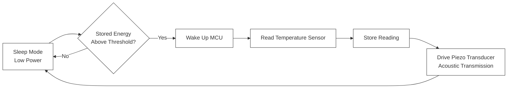

# Self-Powered-Underwater-Data-Logger
This project is a self-powered underwater data logger built around a PIC16F microcontroller that harvests and stores piezoelectric energy to sustain long-term data logging without an external power source. I wrote the embedded C firmware to record real-time temperature readings during underwater deployment, and implemented a threshold-triggered sleep/wake cycle to conserve harvested energy and maximize the system's operational lifespan. To transmit the logged data, I drove a piezoelectric transducer with microcontroller-generated pulses over GPIO, enabling short-range acoustic communication.

## Features
- **Sustainable Operation:** Harvests and stores energy from a piezoelectric element vibrating in water
- **Temperature Logging:** Records temperature readings continuously during deployment
- **Power Saving:** MCU programmed to wake/sleep for energy conservation
- **Data Transmission:** Logged data is transmitted periodically acoustically through a piezo transducer

## PCB Preview

  

<strong>A self-powered underwater piezoelectric based data logger with minimized PCB architecture ((20.3 mm × 20.4 mm)</strong>

## 3D Board Render

  
  

  

<strong>PCB render front and back</strong>

## Schematic

  

<strong>Schematic; Energy harvesting and MCU</strong>

## Firmware Architecture
- **Sleep mode:** The PIC16F stays in low-power sleep  while the LTC3588 rectifies and stores piezoelectric energy in a rechargable battery
- **Threshold wake:** Once capacitor voltage crosses set threshold, an interrupt wakes the MCU
- **Sense and store:** The MCU reads the temperature sensor, maps, and stores the reading
- **Acoustic transmission:** The MCU drives an attached piezoelectric transducer with GPIO-generated pulses to transmit the data acoustically
- **Repeat:** The system returns to sleep and repeats the cycle as energy is harvested

  

<strong>Firmware Flowchart</strong>

