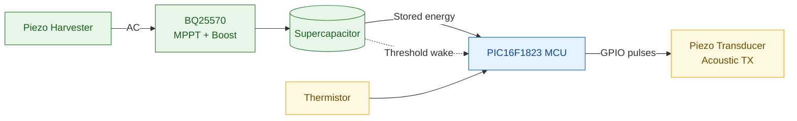
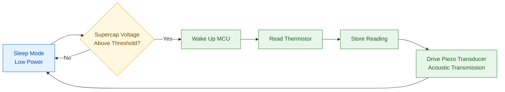

<h1 align="center">Self-Powered Underwater Data Logger</h1>

  
  
  
  
  

  

  <em>A battery-free temperature logger that harvests energy from underwater vibration and transmits its data acoustically.</em>

---

## Overview

This project is a self-powered underwater data logger built around a **PIC16F1823 microcontroller** and a **TI BQ25570** energy-harvesting IC. A piezoelectric element converts water-borne vibration into electrical energy, which is stored in a **supercapacitor** and used to sustain long-term temperature logging with **no battery or external power source**.

I designed the **20.3 mm × 20.4 mm PCB** and wrote the embedded C firmware. The firmware reads a **thermistor** and uses a **threshold-triggered sleep/wake cycle** to spend harvested energy only when enough is available. Logged data is transmitted over a short-range **acoustic link** by driving a piezoelectric transducer with GPIO-generated pulses.

The project was selected for presentation with **Team Canada at MILSET in Abu Dhabi**.

> [!NOTE]
> This project is a **work in progress**. Benchtop testing is complete, and I'm now moving into real underwater testing. See [Project Status](#project-status) for details.

## Table of Contents

- [Features](#features)
- [Specifications](#specifications)
- [System Architecture](#system-architecture)
- [Hardware](#hardware)
- [Firmware](#firmware)
- [Acoustic Transmission](#acoustic-transmission)
- [Project Status](#project-status)

## Features

- **Battery-free operation:** Harvests energy from a piezoelectric element vibrating in water and stores it in a supercapacitor
- **Temperature logging:** Records thermistor readings throughout deployment
- **Low-power firmware:** MCU sleeps until the stored voltage crosses a wake threshold
- **Acoustic data link:** Transmits readings through water with a piezo transducer, no radio or cable required
- **Miniaturized PCB:** Full system on a 20.3 mm × 20.4 mm board

## Specifications

| Parameter            | Value                              |
|----------------------|------------------------------------|
| Microcontroller      | Microchip PIC16F1823 (8-bit, 14-pin) |
| Energy harvester IC  | TI BQ25570 (boost charger + MPPT)  |
| Energy source        | Piezoelectric element              |
| Energy storage       | Supercapacitor                     |
| Temperature sensor   | Thermistor                         |
| Data transmission    | Acoustic, via piezo transducer     |
| PCB dimensions       | 20.3 mm × 20.4 mm                  |

## System Architecture

```mermaid
%%{init: {'theme': 'base', 'themeVariables': {'background': '#ffffff', 'primaryColor': '#ffffff', 'primaryBorderColor': '#333333', 'lineColor': '#333333'}}}%%
flowchart LR
    P[Piezo Harvester] -->|AC| B[BQ25570<br/>MPPT + Boost]
    B --> S[(Supercapacitor)]
    S -->|Stored energy| M[PIC16F1823 MCU]
    S -.->|Threshold wake| M
    T[Thermistor] --> M
    M -->|GPIO pulses| X[Piezo Transducer<br/>Acoustic TX]

    classDef power fill:#E8F5E9,stroke:#2E7D32,color:#1B5E20
    classDef mcu fill:#E3F2FD,stroke:#1565C0,color:#0D47A1
    classDef io fill:#FFF8E1,stroke:#F9A825,color:#6D4C00
    class P,B,S power
    class M mcu
    class T,X io
```

<em>Hardware block diagram: power path (green), control (blue), sensing and I/O (yellow)</em>

## Hardware

### PCB Layout

  
  

<em>PCB layout on a 20.3 mm × 20.4 mm footprint</em>

### 3D Render

  
  

<em>3D board render, front and back</em>

### Schematic

<strong>Click to expand the full schematic</strong>

 

  

<em>Energy harvesting and MCU schematic</em>

### Key Components

| Component            | Function                                                   |
|----------------------|------------------------------------------------------------|
| PIC16F1823           | Main controller: sensing, data handling, TX pulse generation |
| TI BQ25570           | Rectifies and boosts piezo output, charges the supercapacitor |
| Supercapacitor       | Stores harvested energy for each wake cycle                |
| Thermistor           | Temperature sensing                                        |
| Piezo transducer     | Acoustic data transmission                                 |

## Firmware

### Operating Cycle

1. **Sleep:** The PIC16F1823 stays in low-power sleep while the BQ25570 harvests piezoelectric energy into the supercapacitor.
2. **Threshold wake:** When the supercapacitor voltage crosses the set threshold, an interrupt wakes the MCU.
3. **Sense and store:** The MCU reads the thermistor, converts the reading to temperature, and stores it.
4. **Acoustic transmission:** The MCU drives the piezo transducer with GPIO-generated pulses to transmit the data.
5. **Repeat:** The MCU returns to sleep until enough energy is harvested again.

```mermaid
%%{init: {'theme': 'base', 'themeVariables': {'background': '#ffffff', 'primaryColor': '#ffffff', 'primaryBorderColor': '#333333', 'lineColor': '#333333'}}}%%
flowchart LR
    A[Sleep Mode<br/>Low Power] --> B{Supercap Voltage<br/>Above Threshold?}
    B -- No --> A
    B -- Yes --> C[Wake Up MCU]
    C --> D[Read Thermistor]
    D --> E[Store Reading]
    E --> F[Drive Piezo Transducer<br/>Acoustic Transmission]
    F --> A

    classDef sleep fill:#E3F2FD,stroke:#1565C0,color:#0D47A1
    classDef active fill:#E8F5E9,stroke:#2E7D32,color:#1B5E20
    classDef decision fill:#FFF8E1,stroke:#F9A825,color:#6D4C00
    class A sleep
    class C,D,E,F active
    class B decision
```

<em>Firmware state flow</em>

## Acoustic Transmission

Instead of a radio, which works poorly underwater, the logger communicates acoustically. The PIC16F1823 toggles a GPIO pin to drive a piezoelectric transducer, turning each temperature reading into a sequence of sound pulses that propagate through the water to a nearby receiver. This keeps the transmitter to a single pin and no extra driver hardware, which fits the tight energy and board-space budget.

## Project Status

**Work in progress.** The core hardware and firmware have been validated on the bench, and the project is now moving into real-world testing.

- [x] Schematic and PCB design
- [x] Sleep/wake firmware and thermistor logging
- [x] Benchtop testing of energy harvesting, logging, and acoustic transmission
- [ ] Real underwater deployment tests (in progress)

Results from the underwater tests will be added here as they come in.
